# PatronEtConception #
😎
Groupe : 5_2
Binôme : GUERBAA Rayan  & BOUISSA Ilyass

- - - -

### Sommaire ###
* présentation du projet
* organisation du projet
* Conception
* fonctionnement des fonctionnalités implémentées 
* avancée du projet 
* conclusion

- - - -

### Présentation du projet ###
Avant de tester le projet, nous allons vous présenter le projet sur lequel nous travaillons pour notre cours de Patron et Composant.
Il s'agit d'une interface graphique en java qui permet de dessiner des formes ainsi que de les déplacer.
Cette interface est développée en java à l'aide de la librérie JDrawing.

### Organisation du projet ###
Pour ce projet, en binôme nous avons avancé cette interface par incrément, dans lequel nous devions ajouter de nouvelles fonctionnalités chaque semaine.
Pour ce faire, nous avons dû adapter notre projet à chaque incréments en faisant appelle au différents partons de conception à adapter selon nos besoins.

- - - -

### Conception ###
Durant le projet, nous sommes parti avec un projet déjà existant que nous devions entièrement adapter et corriger.
Pour cela, nous avons passé les premières séances à développer des petites fonctionnalités, comprendre le code existant et mettre en place un premier patron.

A partir d'un certain avancement dans le projet, nous avons conçu différents diagrammes pour illustrer les patrons composants que nous avons utilisé.

* Diagramme de classe 
Dans un 1er temps nous avons implementé ces 2 diagramme pour représenté nos premières idées de conception sur l'utilisation du patron composant et visitor
- diagramme de classe 1 : notre projet actuel
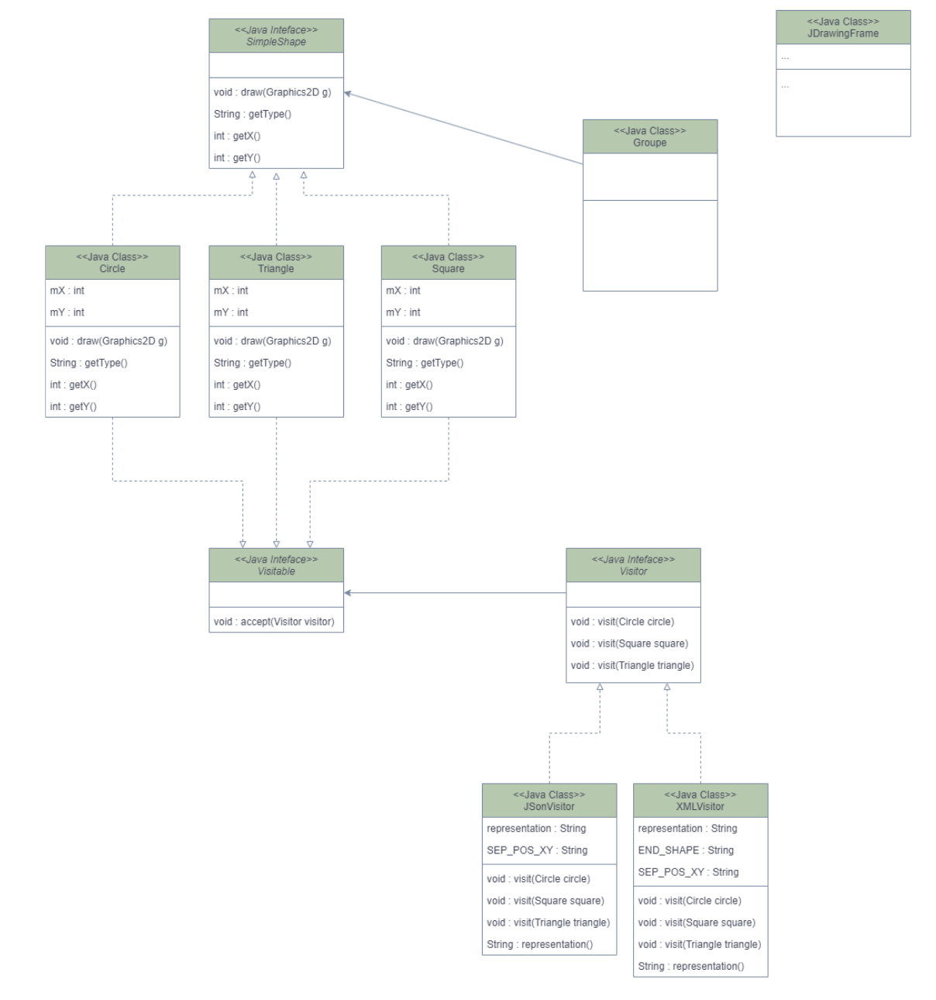
- diagramme de classe 2 : ce que l'on souhaite faire
  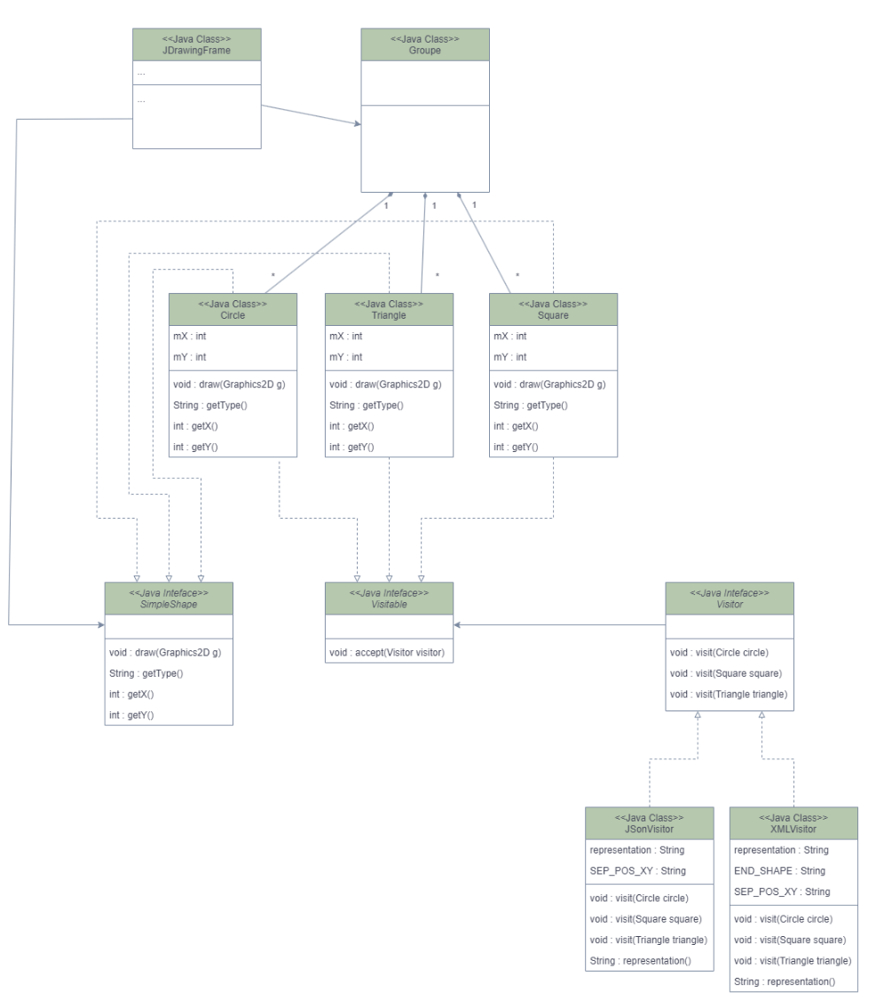

Ensuite, nous avons avancé dans les incréments et nous devions ajouter de nouvelles fonctionnalités dans notre projet.
Pour cela, nous avons avancé notre projet et conçu un nouveau diagramme de classe correpondant à l'état final

* Diagramme de sequence
- Diagramme de séquence de la fonctionnalité Movable
  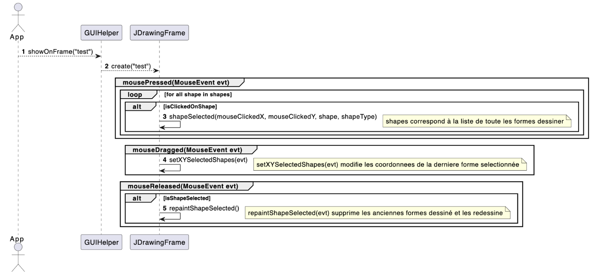

* Diagramme de composant
* 
- - - -

### fonctionnalités implémentées ###
* reset:

    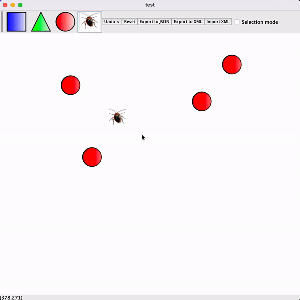

* import

  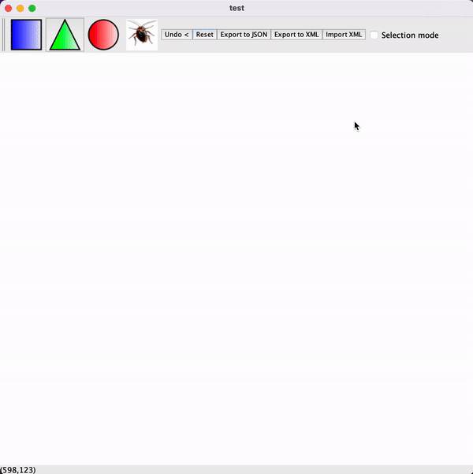

* export

  

* dessiner des formes

  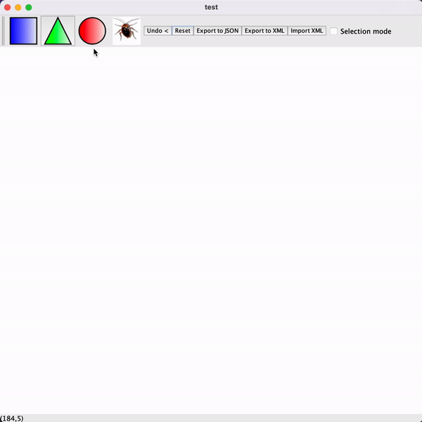

* déplacer une forme

  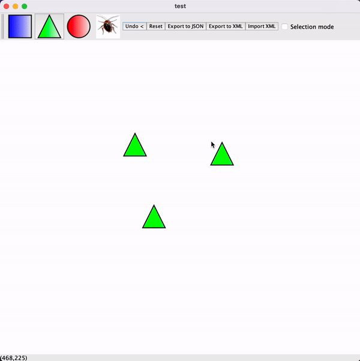

* former un groupe

  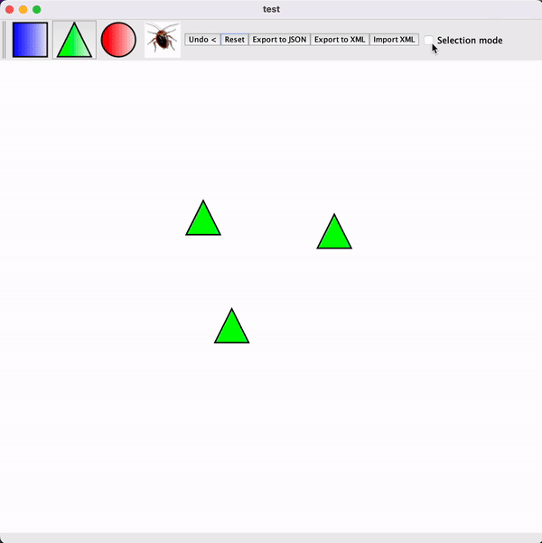

* déplacer un groupe

  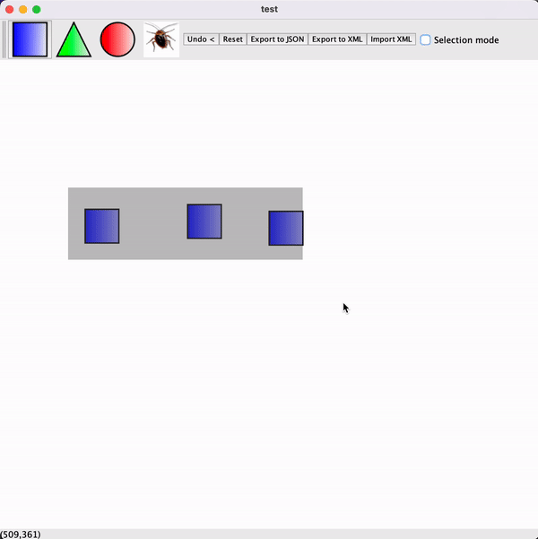

* former un groupe de groupe

  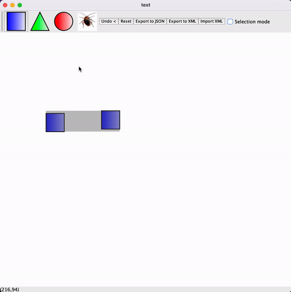

* undo (en cours de développement)

  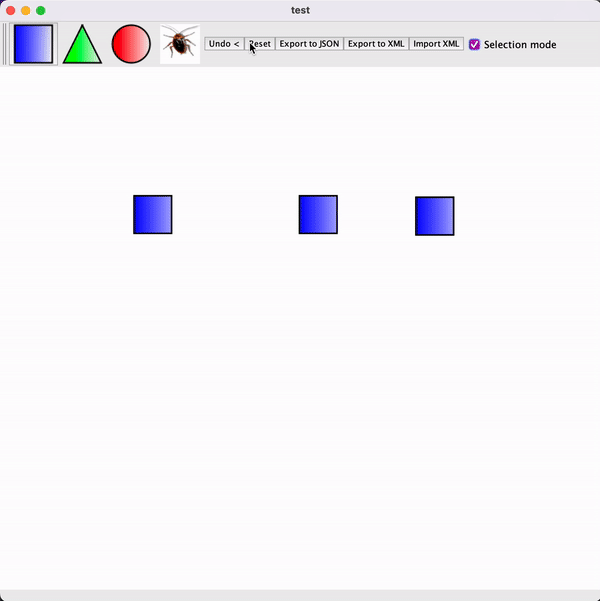

- - - -

### Avancée du projet ###
* notre avancé au premier rendu
- [x] patron composite
- [x] patron factory
- [x] patron visiteur
- [x] création de formes
- [x] création de groupes
- [x] création de groupes avec sous groupes
- [x] déplacement de toutes les formes
- [x] export XML et JSON
- [x] import XML
- [x] bouton reset
- [x] refactoring des méthodes pour clean code
- [x] couverture de test à 25%
- [x] documents de conceptions
- [ ] import JSON
- [ ] control Z
- [ ] rapport

* notre avancé au second rendu
- [x] un rapport un peu plus présentable !
- [x] couverture de test passé à 35% 
- [x] ajout d'une nouvelle image
- [x] ajout d'un bouton undo
- [x] adaptation des documents de conceptions avec la nouvelle image

* ce qui nous reste à implémenter
- [ ] monter la couverture de test à 70%
- [ ] récupérer le .jar d'un autre binôme et le tester avec notre code
- [ ] améliorer le undo pour prendre en compte tous les cas (comme le respect de l'ordre de création des objets)
- [ ] faire un redo
- [ ] ...

- - - -

### Conclusion ###
