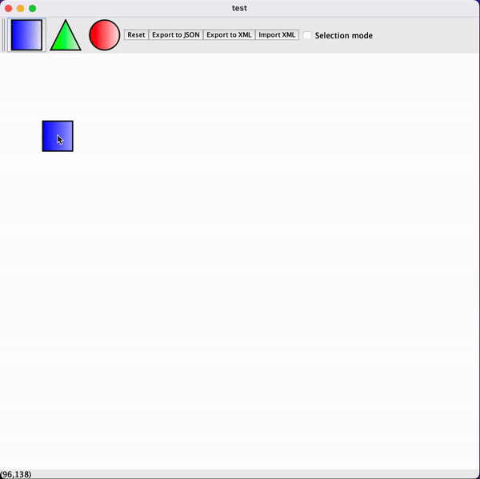

# PatronEtConception #

- - - -

### Sommaire ###
* présentation du projet
* organisation du projet
* Conception
* fonctionnement des fonctionnalités implémentées 
* avancée du projet 
* conclusion

- - - -

### Présentation du projet ###
Avant de tester le projet, nous allons vous présenter le projet sur lequel nous travaillons pour notre cours de Patron et Composant.
Il s'agit d

### Organisation du projet ###

### Conception ###
* Diagramme UML
* Diagramme de sequence
* Diagramme de composant

### Fonctionnement des fonctionnalités ###
* reset
* import
* export
* dessiner des formes
* déplacer une forme
* former un groupe
* déplacer un groupep
* former un groupe de groupe

### Avancée du projet ###
* ce que l'on a réussi à implémenté
- [x] patron composite
- [x] patron factory
- [x] patron visiteur
- [x] création de formes
- [x] création de groupes
- [x] création de groupes avec sous groupes
- [x] déplacement de toutes les formes
- [x] export XML et JSON
- [x] import XML
- [x] bouton reset
- [x] refactoring des méthodes pour clean code
- [x] tests à 25%
- [x] ajout d'une nouvelle image

* ce qui nous reste à implémenter
- [ ] import JSON
- [ ] control Z
- [ ] tests à 70%
- [ ] ...

### Conclusion ###

